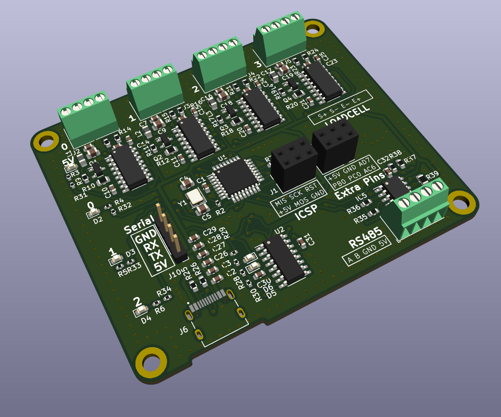
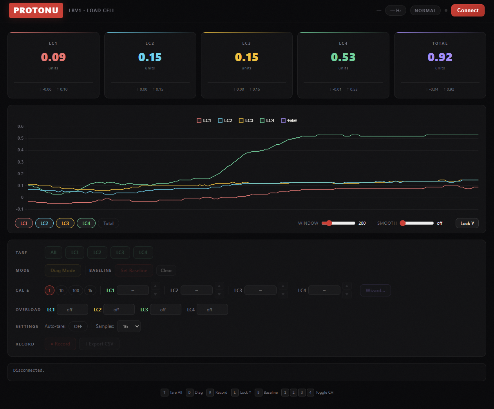

# LBV1 — 4-Channel Load Cell DAQ System

**PROTONU** · Arduino Nano firmware + browser-based real-time monitor



---

## Overview

LBV1 is a 4-channel load cell data acquisition system built around an Arduino Nano and four HX711 24-bit ADC modules. It streams synchronized weight readings over USB serial at 115200 baud, and pairs with a browser-based dashboard for real-time visualization, calibration, and data logging — no drivers or software installation required.

**Key specs:**
- 4 independent load cell channels (e.g. YZC-133 3 kg cells)
- 24-bit resolution via HX711 ADC
- 80 samples per second per channel
- Configurable averaging (1–128 samples)
- Calibration factors persisted in EEPROM
- Overload detection with LED indicator
- Auto-tare on boot (configurable)

---

## Web Dashboard



Open `index.html` in any browser that supports the **Web Serial API** (Chrome / Edge 89+). Click **Connect**, select the Arduino's COM port, and the dashboard connects instantly.

### Features

| Feature | Description |
|---|---|
| Live metric cards | Per-channel weight + sum channel, updated in real time |
| Multi-channel chart | Scrolling time-series with configurable time window (5 s – 5 min) |
| EMA smoothing | Exponential moving average filter, adjustable per channel |
| Dark / Light theme | Toggle in the navbar |
| Tare | Tare all or individual channels with one click |
| Calibration | Direct factor entry or known-mass calibration wizard |
| Overload alerts | Visual alert when any channel exceeds its threshold |
| Baseline / drift | Set a baseline and track drift over time |
| Keyboard shortcuts | Full keyboard control (see table below) |
| Data export | Download recorded data as CSV |

### Keyboard Shortcuts

| Key | Action |
|-----|--------|
| `T` | Tare all channels |
| `Space` | Pause / resume chart |
| `C` | Clear chart history |
| `D` | Toggle dark / light theme |
| `1`–`4` | Toggle individual channel visibility |
| `5` | Toggle sum channel |

---

## Hardware

### PCB

The custom PCB (shown above) integrates:
- Arduino Nano footprint
- 4× HX711 module headers
- 4× 4-pin terminal blocks for load cell wiring
- 3× status LEDs
- ICSP header for bootloader flashing
- Extra GPIO breakout header

### Pinout

| Signal | Arduino Pin |
|--------|-------------|
| LC1 DOUT | A2 |
| LC1 SCK | A3 |
| LC2 DOUT | 4 |
| LC2 SCK | 7 |
| LC3 DOUT | A5 |
| LC3 SCK | A4 |
| LC4 DOUT | 10 |
| LC4 SCK | 9 |
| RATE\_pin | 2 |
| LED0 | 3 |
| LED1 | 5 |
| LED2 | 6 |

`RATE_pin` is driven HIGH on startup to select 80 SPS mode on all HX711 modules.

**LED2** blinks at 5 Hz whenever any channel is in overload.

### Load Cell Wiring

Each HX711 channel connects to a Wheatstone bridge load cell using four wires:

| Load Cell Wire | HX711 Pin |
|----------------|-----------|
| Red (E+) | E+ |
| Black (E−) | E− |
| White (A−) | A− |
| Green (A+) | A+ |

---

## Firmware

### Requirements

- **Arduino IDE** 1.8+ or **Arduino CLI**
- **Board**: Arduino Nano (ATmega328P)
- **Library**: [HX711_ADC](https://github.com/olkal/HX711_ADC) v0.1+ — install via Arduino Library Manager

### Build & Upload

**Arduino IDE:**
1. Open `LBV1.ino`
2. Select **Tools → Board → Arduino Nano**
3. Select the correct COM port
4. Click **Upload**

**Arduino CLI:**
```bash
arduino-cli compile --fqbn arduino:avr:nano LBV1
arduino-cli upload --fqbn arduino:avr:nano -p <PORT> LBV1
```

---

## Serial Protocol

**Baud rate:** 115200

### Output (firmware → host)

All frames are terminated with `$\n`.

| Frame | Format | Description |
|-------|--------|-------------|
| Weight data | `<v1>\|<v2>\|<v3>\|<v4>$` | Signed integers, value × 100 (i.e. centiunits). Negated to account for inverted mounting. |
| Calibration | `CAL:<f1>\|<f2>\|<f3>\|<f4>$` | Cal factors × 10 as integers |
| Thresholds | `THR:<t1>\|<t2>\|<t3>\|<t4>$` | Overload thresholds × 100 |
| Settings | `AUTOTARE:<0\|1>$` | Auto-tare on boot setting |
| Samples | `SAMPLES:<n>$` | Active averaging window |
| Overload | `OVL:<0\|1>\|<0\|1>\|<0\|1>\|<0\|1>$` | Sent only on state change |
| Tare done | `TARE_DONE:<ch>$` | Sent when a tare completes |
| Diagnostic | `RAW:<r1>\|<r2>\|<r3>\|<r4>$` | Raw ADC counts (diag mode only) |

### Input Commands (host → firmware)

Send commands as newline-terminated ASCII strings.

| Command | Action |
|---------|--------|
| `t` | Tare all 4 channels |
| `t<ch>` | Tare a single channel (0–3) |
| `k<ch>:<mass>` | Known-mass calibration — place a known weight on channel `ch` and send its mass in the working unit |
| `v<ch>:<value>` | Set calibration factor directly for channel `ch` |
| `o<ch>:<threshold>` | Set overload threshold for channel `ch` |
| `sm<n>` | Set averaging samples (1, 2, 4, 8, 16, 32, 64, 128) |
| `at0` / `at1` | Disable / enable auto-tare on boot |
| `c` | Request current calibration, thresholds, and settings |
| `p` | Toggle diagnostic mode (raw ADC output) |
| `q` / `a` | Increase / decrease LC1 cal factor by 10 |
| `w` / `s` | Increase / decrease LC2 cal factor by 10 |
| `e` / `d` | Increase / decrease LC3 cal factor by 10 |
| `r` / `f` | Increase / decrease LC4 cal factor by 10 |

---

## Calibration

Calibration factors are stored as 4-byte IEEE 754 floats in EEPROM. The default is `14000.0`, which works well for YZC-133 3 kg load cells.

### EEPROM Map

| Offset | Size | Content |
|--------|------|---------|
| 0–15 | 4 × float | Calibration factors (LC1–LC4) |
| 16–31 | 4 × float | Overload thresholds (LC1–LC4) |
| 32 | 1 byte | Auto-tare flag |
| 33 | 1 byte | Samples-in-use setting |

### Calibration Procedure

1. Tare all channels (`t`).
2. Place a known reference weight on the target load cell.
3. Send `k<ch>:<mass>` — the firmware computes and saves the new calibration factor automatically.
4. Verify the reading and repeat for each channel.

Alternatively, use the calibration wizard in the web dashboard.

---

## Firmware Architecture

The entire firmware is `LBV1.ino` (~340 lines):

```
setup()
  ├── Pin / LED init
  ├── loadCal()         — read cal factors from EEPROM
  ├── loadThresholds()  — read overload thresholds from EEPROM
  ├── loadSettings()    — read auto-tare + samples config from EEPROM
  ├── lc[i].begin()     — start all 4 HX711 objects
  ├── startMultiple()   — wait until all 4 modules are ready (state machine)
  └── setCalFactor()    — apply loaded calibration

loop()
  ├── lc[i].update()    — poll each HX711 (non-blocking)
  ├── Tare notifications — send TARE_DONE when complete
  ├── Synchronized output — emit frame when all 4 channels have fresh data
  ├── Overload detection — send OVL: on state change, blink LED2
  └── Command parser    — line-buffered, handles full command set
```

---

## Version History

| Version | Highlights |
|---------|-----------|
| v1.5 | Sampling config, auto-tare, sum channel, baseline/drift, dark/light theme, keyboard shortcuts, EMA smoothing, time window slider |
| v1.4 | Full feature set, web UI expansion |
| v1.3 | Calibration UX — direct entry, step selector, scroll wheel |

---

## License

© PROTONU. All rights reserved.
